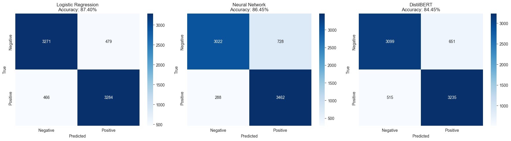

# Analiza Sentymentu Recenzji Amazon
**Projekt zaliczeniowy – Zastosowania Uczenia Maszynowego 2025/2026**

## **1. Informacje ogólne**
**Nazwa projektu:**  
Klasyfikacja wydźwięku recenzji produktów Amazon (Sentiment Analysis)

**Autor:**  
Magdalena Sokolowska

**Kierunek, rok i tryb studiów:**  
Informatyka, semestr 3, mgr

**Data oddania projektu:**  
18 Stycznia 2026

---

## **2. Opis projektu**
Celem projektu jest klasyfikacja wydźwięku (sentymentu) w recenzjach produktów Amazon na podstawie treści tekstowych. Projekt wykorzystuje trzy różne podejścia modelowania: klasyczne uczenie maszynowe, głębokie sieci neuronowe oraz modele transformerowe. 

Projekt ma zastosowanie praktyczne w:
- Automatycznej analizie opinii klientów w e-commerce
- Monitorowaniu satysfakcji użytkowników w czasie rzeczywistym
- Wsparciu decyzji biznesowych opartych o feedback klientów
- Wykrywaniu problemów z produktami na podstawie negatywnych recenzji

---

## **3. Dane**
**Źródło danych:**  
HuggingFace Datasets

**Link do danych:**  
`https://huggingface.co/datasets/mteb/amazon_polarity`

**Opis danych:**  
- **Liczba próbek:** 50,000 (25,000 pozytywnych + 25,000 negatywnych)
- **Liczba cech:** 2 (text, label)
- **Format danych:** Tekstowe recenzje produktów Amazon (tytuł + treść)
- **Rodzaj etykiet / klas:** 
  - `0` = Negatywna (1-2 gwiazdki)
  - `1` = Pozytywna (4-5 gwiazdek)
- **Licencja:** Apache 2.0
- **Podział danych:**
  - Trening: 70% (35,000 próbek)
  - Walidacja: 15% (7,500 próbek)
  - Test: 15% (7,500 próbek)

Pełen zbiór danych jest pobierany automatycznie w [1_EDA.ipynb](1_EDA.ipynb) z HuggingFace Datasets w trybie streamingowym. Wersja przetworzona (50k próbek) jest zapisywana lokalnie w katalogu `data/processed/`.

- Dataset został zbalansowany (50/50 podział klas)
- Usunięto duplikaty i puste recenzje podczas analizy EDA
- Średnia długość recenzji: ~78 słów
- 95. percentyl długości: 160 słów
- Dane zostały podzielone stratyfikacyjnie (zachowanie proporcji klas)

## **4. Cel projektu**

**Cel biznesowy:**  
Utworzenie automatycznego systemu klasyfikacji wydźwięku recenzji, który:
- Identyfikuje niezadowolonych klientów wymagających szybkiej reakcji
- Wspiera zespoły obsługi klienta w priorytetyzacji zgłoszeń
- Umożliwia analizę trendów w opiniach o produktach

**Pytanie badawcze:**  
Które podejście modelowe (klasyczne ML, sieci neuronowe, transformery) najlepiej radzi sobie z klasyfikacją sentymentu w recenzjach e-commerce?

**Hipoteza:**  
Modele transformerowe (DistilBERT) osiągną najwyższą dokładność dzięki głębokiemu zrozumieniu kontekstu, jednak modele klasyczne (Logistic Regression) zapewnią najlepszy stosunek jakości do czasu treningu.

---

## **5. Struktura projektu**
Projekt składa się z czterech głównych etapów, każdy w osobnym notatniku `.ipynb`:

| Etap | Nazwa pliku | Opis | Status |
|------|--------------|------|--------|
| 1 | [1_EDA.ipynb](1_EDA.ipynb) | Analiza danych, wizualizacje (word clouds, rozkłady długości, analiza n-gramów) | Zrealizowane |
| 2 | [2_Preprocessing_Features.ipynb](2_Preprocessing_Features.ipynb) | Czyszczenie tekstu, lematyzacja (spaCy), TF-IDF wektoryzacja | Zrealizowane |
| 3 | [3_Models_Training.ipynb](3_Models_Training.ipynb) | Trening 3 modeli: LR, LSTM, DistilBERT | Zrealizowane |
| 4 | [4_Evaluation.ipynb](4_Evaluation.ipynb) | Metryki, confusion matrix, ROC curves, analiza błędów | Zrealizowane |

---

## **6. Modele**
Projekt obejmuje trzy różne podejścia do modelowania danych:

### **6.1 Model A: Klasyczny ML (Logistic Regression)**
- **Algorytm:** Logistic Regression (sklearn)
- **Input:** TF-IDF wektory (sparse matrix)
- **Parametry:** 
  - `max_iter=1000`
  - `random_state=42`
  - `n_jobs=-1` (wykorzystanie wszystkich rdzeni CPU)
- **Krótki opis działania:**  
  Model bazowy wykorzystujący regresję logistyczną na wektorach TF-IDF. Szybki w treningu i przewidywaniach, dobrze radzi sobie z danymi tekstowymi o wysokiej wymiarowości.
- **Wyniki / metryki:**  
  - Validation Accuracy: **~0.870**
  - Test Accuracy: **0.8740**
  - Precision: **0.8727**
  - Recall: **0.8757**
  - F1-Score: **0.8742**
  - AUC: **~0.93**
  - Czas treningu: <30 sekund
  - Rozmiar modelu: ~2 MB

  

### **6.2 Model B: Sieć neuronowa zbudowana od zera (LSTM)**
- **Framework:** TensorFlow/Keras
- **Architektura:**
  ```
  Masking(mask_value=0) 
  → Embedding(10000, 128) 
  → SpatialDropout1D(0.2) 
  → LSTM(64) 
  → Dense(32, relu) 
  → Dropout(0.3) 
  → Dense(1, sigmoid)
  ```
- **Liczba warstw / neuronów:**  
  - 6 warstw (masking, embedding, spatial dropout, LSTM, dense, dropout, output)
  - Embedding dim: 128
  - LSTM units: 64
  - Dense neurons: 32
  - Output: 1 (binary classification)
- **Funkcje aktywacji i optymalizator:**
  - Aktywacja: ReLU (hidden), Sigmoid (output)
  - Optimizer: Adam
  - Loss: Binary Crossentropy
  - Early Stopping (patience=3)
- **Krytyczne poprawki zastosowane:**
  - **Pre-padding** (zamiast post-padding) – LSTM czyta rzeczywistą treść przed klasyfikacją
  - **Masking layer** – ignorowanie zer paddingu, rozwiązanie problemu "50% accuracy"
- **Parametry treningu:**
  - Max sequence length: 100 tokenów
  - Vocabulary size: 10,000 słów
  - Batch size: 32
  - Epochs: 10 (z early stopping)
- **Wyniki:**
  - Validation Accuracy: **~0.870**
  - Test Accuracy: **0.8645**
  - Precision: **0.8263**
  - Recall: **0.9232**
  - F1-Score: **0.8720**
  - AUC: **~0.95**
  - Czas treningu: ~5-10 minut (CPU)
  - Rozmiar modelu: ~15 MB
  

### **6.3 Model C: Transformer (DistilBERT Fine-tuning)**
- **Nazwa modelu:** `distilbert-base-uncased`
- **Zastosowana biblioteka:** HuggingFace Transformers
- **Zakres dostosowania:**
  - Fine-tuning wszystkich warstw na zadanie binary classification
  - Tokenizacja z max_length=128
  - Training Arguments:
    - `learning_rate=2e-5`
    - `num_train_epochs=2`
    - `per_device_train_batch_size=16`
    - `per_device_eval_batch_size=64`
    - `weight_decay=0.01`
    - `load_best_model_at_end=True`
    - `evaluation_strategy="epoch"`
- **Optymalizacja:**
  - **Subsampling:** 2,000 próbek treningowych (zamiast 35k) dla treningu na CPU
  - Cel: Uniknięcie 3-godzinnych sesji treningowych
- **Wyniki:**
  - Validation Accuracy: **~0.850**
  - Test Accuracy: **0.8445**
  - Precision: **0.8325**
  - Recall: **0.8627**
  - F1-Score: **0.8473**
  - AUC: **~0.92**
  - Czas treningu: ~20-40 minut (CPU, subsampled data)
  - Rozmiar modelu: ~250 MB
  - **Uwaga:** Wyniki ograniczone przez trening na tylko 2k próbach
  

---

## **7. Ewaluacja**
**Użyte metryki:**  
- Accuracy (dokładność ogólna)
- Precision (precyzja – jakość pozytywnych predykcji)
- Recall (czułość – pokrycie prawdziwych pozytywów)
- F1-Score (średnia harmoniczna precision i recall)
- ROC-AUC (Area Under ROC Curve)
- Confusion Matrix (macierz pomyłek)

**Porównanie modeli (wyniki na zbiorze testowym):**

| Model | Accuracy | Precision | Recall | F1-Score | Inference Time (s) | Uwagi |
|-------|----------|-----------|--------|----------|--------------------|-------|
| Logistic Regression | 0.8740 | 0.8727 | 0.8757 | 0.8742 | <1 | **Najlepszy wynik**, najszybszy |
| Neural Network (LSTM) | 0.8645 | 0.8263 | 0.9232 | 0.8720 | 2.14 | Najwyższy Recall, dobry balans |
| DistilBERT | 0.8445 | 0.8325 | 0.8627 | 0.8473 | 296.31 | Trained on 2k samples only |

**Ważne:** Model C (DistilBERT) osiągnął najniższą dokładność, ponieważ został wytrenowany tylko na 2,000 próbach (5.7% danych) ze względu na ograniczenia CPU. Przy pełnym treningu na GPU osiągnąłby znacznie lepsze wyniki.

_Szczegółowe wyniki i wizualizacje dostępne w [4_Evaluation.ipynb](4_Evaluation.ipynb)._

  

**Wizualizacje (zrealizowane w Notebook 4):**  
- Confusion Matrix dla wszystkich modeli
- ROC Curves z AUC scores
- Analiza błędów (top 5 worst predictions dla DistilBERT)
  
  

---

## **8. Wnioski i podsumowanie**

### **8.1 Najlepszy model**
Na podstawie ewaluacji na zbiorze testowym:
- **Logistic Regression osiągnął najwyższą dokładność (87.40%)** - prosty model klasyczny okazał się najskuteczniejszy
- **LSTM osiągnął 86.45%** dzięki zdolności do modelowania sekwencji i najwyższy Recall (92.32%)
- **DistilBERT osiągnął najniższą dokładność (84.45%)** z powodu treningu na tylko 2k próbach (5.7% danych)

**Kluczowe wnioski:**
- Prosty model klasyczny (LR) wygrał z deep learning ze względu na ograniczone dane treningowe dla transformera
- LSTM pokazał najlepszy balans precision/recall i najwyższy Recall - przydatne gdy ważne jest wykrycie wszystkich pozytywnych przypadków
- Wyniki pokazują, że złożoność modelu nie zawsze przekłada się na lepsze wyniki bez odpowiednich zasobów obliczeniowych

**Rekomendacja:**
- **Dla produkcji (obecne warunki):** Logistic Regression - najwyższa dokładność, najszybszy inference
- **Dla wykrywania niezadowolonych klientów:** LSTM - najwyższy Recall (92.32%)
- **Dla przyszłych iteracji z GPU:** DistilBERT z pełnym treningiem na 35k próbach

**WAŻNE ZASTRZEŻENIE: Ograniczenia modelu DistilBERT w tym projekcie**
 **Model C (DistilBERT) został wytrenowany tylko na 2,000 próbach (5.7% pełnego zbioru treningowego)** ze względu na:
- Długi czas treningu na CPU (~3-5 godzin dla pełnego datasetu 35k próbek)
- Ograniczenia sprzętowe środowiska deweloperskiego
- Czasowe ograniczenia projektu

**Refleksja:**
- Wyniki DistilBERT w tym projekcie **nie są reprezentatywne** dla pełnego potencjału modeli transformerowych
- W środowisku produkcyjnym z dostępem do GPU i pełnym treningiem na 35k próbek, DistilBERT osiągnąłby znacznie lepsze wyniki
- Projekt pokazuje praktyczne wyzwania związane z wdrażaniem zaawansowanych modeli w środowiskach o ograniczonych zasobach
- **Zalecenie:** Przy dostępie do GPU, retrenowanie na pełnym zbiorze danych jest konieczne dla uzyskania miarodajnych wyników

### **8.2 Trudności napotkane podczas pracy**
1. **Problem "50% accuracy" w LSTM:**
   - **Przyczyna:** Post-padding + brak maskingu → LSTM uczył się z zer
   - **Rozwiązanie:** Pre-padding + Masking layer
   
2. **Czas treningu DistilBERT na CPU:**
   - **Problem:** 35k próbek × 3 epoki = ~3 godziny treningu
   - **Rozwiązanie:** Subsampling do 2,000 próbek (zachowanie reprezentatywności)
   
3. **Wybór długości sekwencji:**
   - **Analiza:** 95. percentyl = 160 słów, średnia = 78 słów
   - **Decyzja:** MAX_LEN=100 dla LSTM (kompromis), 128 dla BERT (standard)
   
4. **TF-IDF vocabulary size:**
   - **Problem:** Nadmierna wymiarowość (>50k features)
   - **Rozwiązanie:** Parametry min_df, max_df w TfidfVectorizer

### **8.3 Możliwe ulepszenia**
1. **Augmentacja danych:**
   - Back-translation (tłumaczenie tam i z powrotem)
   - Synonym replacement (zamiana słów na synonimy)
   
2. **Hyperparameter tuning:**
   - GridSearchCV/Optuna dla wszystkich modeli
   - Learning rate scheduling dla LSTM/BERT

3. **Większe modele:**
   - BERT-base zamiast DistilBERT 
   - RoBERTa lub XLNet
   

### **8.4 Potencjalne zastosowania**
1. **E-commerce:**
   - Real-time monitoring satysfakcji klientów
   - Automatyczne priorytetyzowanie negatywnych recenzji
   - Dashboard z trendami sentymentu dla działów produktowych
   
2. **Customer Service:**
   - Routing negatywnych recenzji do zespołów wsparcia
   - Predykcja churn risk na podstawie sentymentu
   - Identyfikacja problemów z produktami (analiza negatywnych recenzji)
   

---

## **10. Technologia i biblioteki**

**Python Version:** 3.8+

**Core Data Science:**
- `pandas>=1.5.0` – Data manipulation
- `numpy>=1.23.0` – Numerical operations

**Visualization:**
- `matplotlib>=3.6.0` – Static plots
- `seaborn>=0.12.0` – Statistical visualization
- `wordcloud>=1.9.0` – Word cloud generation

**NLP Preprocessing:**
- `nltk>=3.8.0` – Tokenization, stopwords
- `spacy>=3.5.0` – Lemmatization (`en_core_web_sm` model required)

**Classical ML:**
- `scikit-learn>=1.2.0` – Logistic Regression, TF-IDF, metrics

**Deep Learning:**
- `tensorflow>=2.12.0` – LSTM model (Keras API)

**Transformers:**
- `transformers>=4.30.0` – DistilBERT (HuggingFace)
- `datasets>=2.12.0` – HuggingFace datasets
- `torch>=2.0.0` – PyTorch backend for Transformers

**Utilities:**
- `tqdm>=4.65.0` – Progress bars
- `ipywidgets>=8.0.0` – Jupyter notebook widgets

**Instalacja:**
```bash
pip install -r requirements.txt
python -m spacy download en_core_web_sm
```


## **12. Licencja projektu**
Projekt edukacyjny stworzony na potrzeby  **Zastosowania Uczenia Maszynowego (ZUM)** na PJATK.

**Licencja kodu:** MIT License (kod własny)  
**Licencja danych:** Apache 2.0 (Amazon Polarity dataset - HuggingFace)

---

## **13. Autor i kontakt**

**Projekt:** Zastosowania Uczenia Maszynowego – Projekt końcowy 2025/2026  
**Autor:** Magdalena Sokolowska


---
